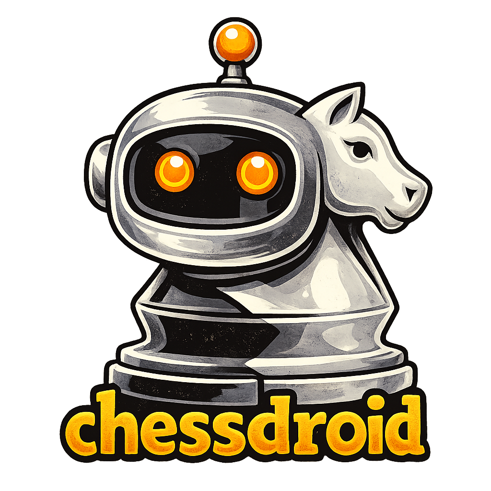

# ChessDroid

[](https://dotnet.microsoft.com/download/dotnet/8.0)
[](https://www.microsoft.com/windows)
[](LICENSE)
[](CHANGELOG.md)

**Offline chess analysis & training for Windows**

chessdroid is a desktop application built for focused chess study. Analyze positions, explore ideas, and learn with your favorite UCI engines - all on your computer, no internet required.



## Features

### Core Analysis
- **UCI Engine Support** - Works with any UCI-compatible engine (Stockfish, Komodo, Ethereal, Leela, etc.)
- **Computer Vision** - Automatic board recognition from screenshots using OpenCV
- **Auto-Monitoring (BETA)** - Continuous board monitoring with automatic turn detection
- **Multi-PV Analysis** - Display up to 3 best lines simultaneously with evaluations
- **Smart Explanations** - Human-readable explanations for 30+ tactical patterns
- **Threat Detection** - Shows NEW threats created by each move (pins, forks, attacks)
- **Defense Detection** - Shows defensive aspects of moves (protecting pieces, blocking attacks)
- **Move Quality Colors** - 6 levels from Brilliant (!!) to Blunder (??) with color coding
- **Win Percentage** - Side-aware win probability using Stockfish evaluation model

### Lc0-Inspired Features (v2.2.0)
- **WDL Display** - Win/Draw/Loss probabilities from engine analysis
- **Opening Book (BETA)** - 565+ opening positions with ECO codes and opening names
- **Move Quality Indicators** - Brilliant, Best, Good, Inaccuracy, Mistake, Blunder labels
- **Aggressiveness Slider** - Functional style control (0=solid, 100=aggressive) that actually affects move selection

### Customization
- **Dark/Light Themes** - Fully-featured dark mode with automatic theme persistence
- **Complexity Levels** - Choose from Beginner, Intermediate, Advanced, or Master explanations
- **Feature Toggles** - 11+ toggles to customize analysis (Tactical, Positional, Endgame, Opening, Win%, Tablebase, SEE, WDL, etc.)
- **Flexible Settings** - Customize engine depth, match threshold, and display preferences

### User Experience
- **Global Hotkeys** - `Alt+X` to analyze, `Alt+K` to toggle auto-monitor (works even when minimized)
- **Debug Mode** - Optional cell visualization for troubleshooting piece recognition
- **Tablebase-Aware** - Endgame-specific analysis for positions with 7 or fewer pieces
- **Config Hot-Reload** - Settings changes take effect immediately without restart

## Supported Chess Websites

- Chess.com
- Lichess.org
- ChessPuzzle.net
- Any other website with proper templates

## Requirements

- **OS**: Windows 10/11 (64-bit)
- **.NET**: .NET 8.0 Runtime
- **Engine**: Any UCI-compatible chess engine (Stockfish recommended)
- **Templates**: PNG files like wK, wQ, wB, etc.

## Installation

### Option 1: Download Release (Recommended)

1. Download the latest release from the [Releases](../../releases) page
2. Extract the ZIP file to your preferred location
3. Run `chessdroid.exe`

### Option 2: Build from Source

```bash
# Clone the repository
git clone https://github.com/jio1337/chessdroid.git
cd chessdroid

# Navigate to project directory
cd test

# Restore dependencies
dotnet restore

# Build the project
dotnet build --configuration Release

# Run the application
dotnet run --configuration Release
```

## Quick Start

1. **Launch ChessDroid** - Run `chessdroid.exe`
2. **Configure Engine** - Go to Settings and select your UCI engine
3. **Take Screenshot** - Capture a chess position from your preferred website
4. **Press Alt+X** - ChessDroid will analyze the position and show best moves
5. **Review Analysis** - See move explanations, evaluations, and multiple lines

## Hotkeys

| Hotkey | Action |
|--------|--------|
| `Alt+X` | Analyze current position (Show Lines) |
| `Alt+K` | Toggle auto-monitoring on/off |

## Configuration

chessdroid stores settings in `config.json`. You can customize:

### Engine & Analysis
- **Selected Engine**: Choose from available UCI engines
- **Engine Depth**: Analysis depth (1-30, default: 15)
- **Multi-PV Lines**: Show 2nd and 3rd best lines (optional)
- **Aggressiveness**: 0-100 slider (0=solid, 50=balanced, 100=aggressive)

### Visual Recognition
- **Match Threshold**: Piece recognition sensitivity (0.1-1.0, default: 0.55)
- **Canny Thresholds**: Edge detection for board recognition
- **Selected Site**: Chess.com, Lichess, or ChessPuzzle templates

### Display & UI
- **Theme**: Dark or Light mode (fully integrated)
- **Complexity Level**: Beginner, Intermediate, Advanced, or Master
- **Feature Toggles**: Enable/disable specific analysis features (11+ options)
- **Threats & Defenses**: Toggle threat/defense display on move explanations
- **WDL Display**: Show Win/Draw/Loss probabilities
- **Opening Name**: Show detected opening name (BETA)
- **Auto-Monitor Board**: Enable continuous board monitoring (BETA - disabled by default)
- **Show Debug Cells**: Visual debugging for piece recognition

## Technology Stack

- **.NET 8.0** - Application framework
- **WinForms** - User interface
- **EmguCV/OpenCV** - Computer vision for board detection
- **UCI Protocol** - Chess engine communication
- **Service-Oriented Architecture** - Clean separation of concerns (73% code reduction through refactoring)

## Important Notice

**chessdroid is for educational purposes only.**

This tool is designed for:
- Analyzing finished games
- Understanding chess puzzles
- Exploring positions offline
- Chess study and training

**DO NOT use this tool:**
- During live online games
- To gain unfair advantage in rated games
- To violate chess platform terms of service

By using chessdroid, you agree to use it ethically and in accordance with all applicable chess platform policies. Please read our terms on chessdroid.net before downloading/installing.

## Development

### Prerequisites

- Visual Studio 2022 or VS Code
- .NET 8.0 SDK
- Windows 10/11

### Building

```bash
# Debug build
dotnet build

# Release build
dotnet build --configuration Release

# Run tests (if available)
dotnet test
```

## Known Issues

- Board detection may struggle with non-standard board themes
- Very small board sizes (< 200px) may not be detected reliably
- Some piece sets may require custom templates
- **Auto-Monitoring (BETA)**: Occasional engine crashes on rapid position changes
- **Auto-Monitoring (BETA)**: May miss opponent moves if they respond extremely quickly (within 200ms debounce window)
- **Opening Book (BETA)**: Coverage is not exhaustive, strongest for main line openings

## FAQ

**Q: Which chess engine should I use?**
A: Stockfish is recommended. Download the latest version from [stockfishchess.org](https://stockfishchess.org/download/).

**Q: Why isn't my board being detected?**
A: Ensure the board is clearly visible and try adjusting the Canny thresholds in Settings. Enable "Debug Cells" to see what ChessDroid is detecting.

**Q: Can I use this on Mac or Linux?**
A: Currently ChessDroid is Windows-only. Cross-platform support may be added in the future.

**Q: Is this tool allowed on chess platforms?**
A: No. Using analysis tools during live games violates most chess platform terms of service and is considered cheating. Please read our terms on chessdroid.net before downloading/installing.

**Q: How does the Aggressiveness slider work?**
A: The slider (0-100) affects which moves are recommended. At 0 (solid), ChessDroid prefers safe, quiet moves. At 100 (aggressive), it prefers sharp, tactical moves. The engine still calculates all moves, but the selection is filtered based on "sharpness" metrics within acceptable evaluation tolerance.

## License

This project is licensed under the MIT License - see the [LICENSE](LICENSE) file for details.

## Acknowledgments

- [EmguCV](http://www.emgu.com/) - OpenCV wrapper for .NET
- [ChessDotNet](https://github.com/ProgramFOX/Chess.NET) - Chess library for .NET
- [Stockfish](https://stockfishchess.org/) - World's strongest chess engine, inspiration for move evaluation features
- [Ethereal](https://github.com/AndyGrant/Ethereal) - High-performance chess engine, inspiration for positional evaluation
- [Lc0](https://lczero.org/) - Leela Chess Zero, inspiration for WDL display and aggressiveness features

## Disclaimer

chessdroid is an independent project and is not affiliated with, endorsed by, or connected to Chess.com, Lichess.org, ChessPuzzle.net, or any other chess platform. All trademarks belong to their respective owners.

---

**Made with chess by the chessdroid team**
